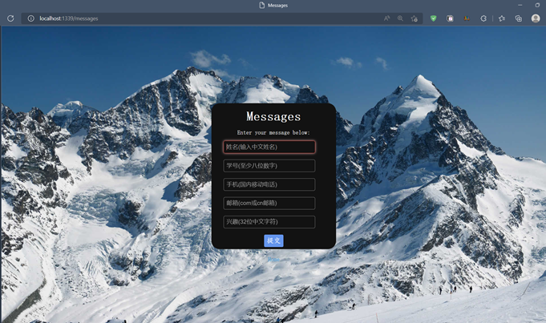
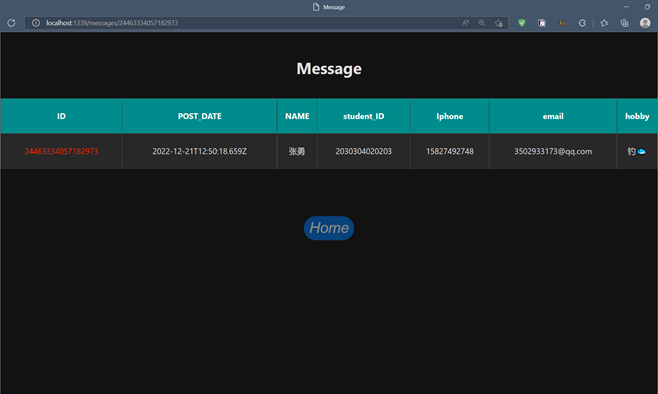
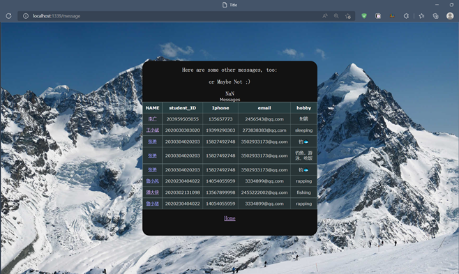

## dace_rest_api
### 基于node开发的用户信息登录系统
### [宣传视频](https://www.bilibili.com/video/av23121122/)
### 项目已部署，在线Demo
- info website ：http://198.12.121.74:1339
### 新增与优化
- [x] 优化了各个页面的显示
- [x] 美化登录等页面
- [x] 对list页面进行了表格封装，便于查阅
- [x] 新增关于页面
- [x] 新增了多个信息如邮箱电话等
- [x] 增加了命令行独立程序
- [x] 将端口设置在全局环境中

### UI展示

### 所用技术

- commander.js
- axios
- Node.js

### 本地开发运行

- 执行命令 `npm install `
- 本地启动 `npm start`
- 部署命令行应用程序 `npm link`
### 技术疑问交流
学号：2020302131098
姓名：潘鹏飞

